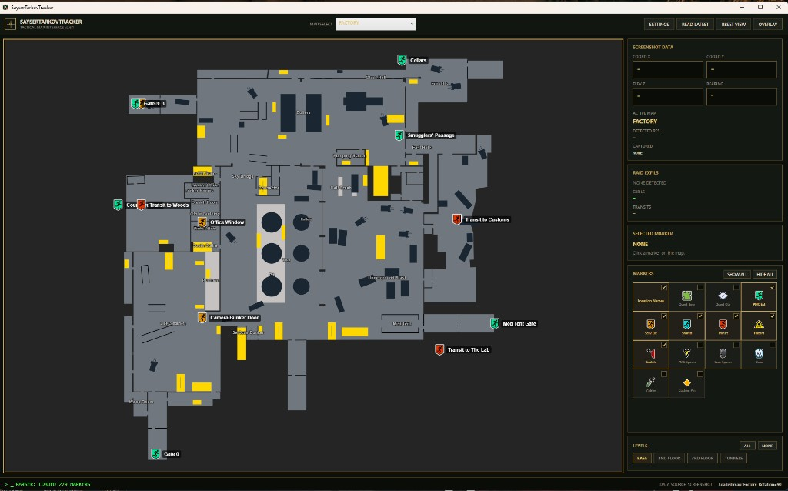
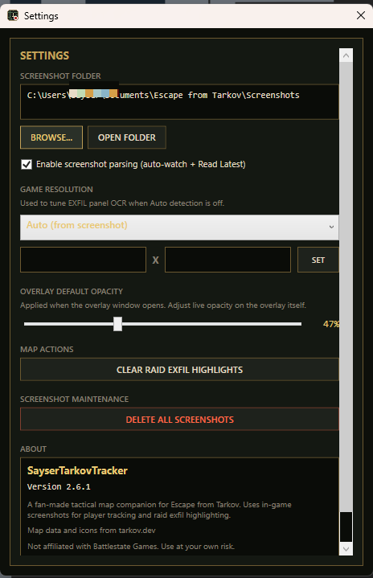
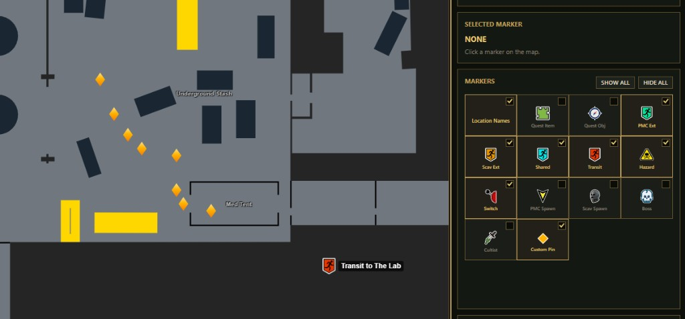
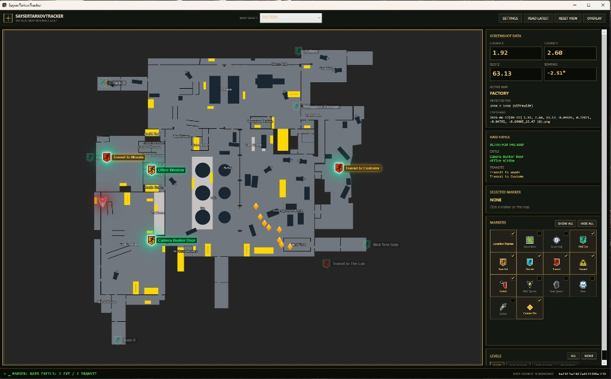
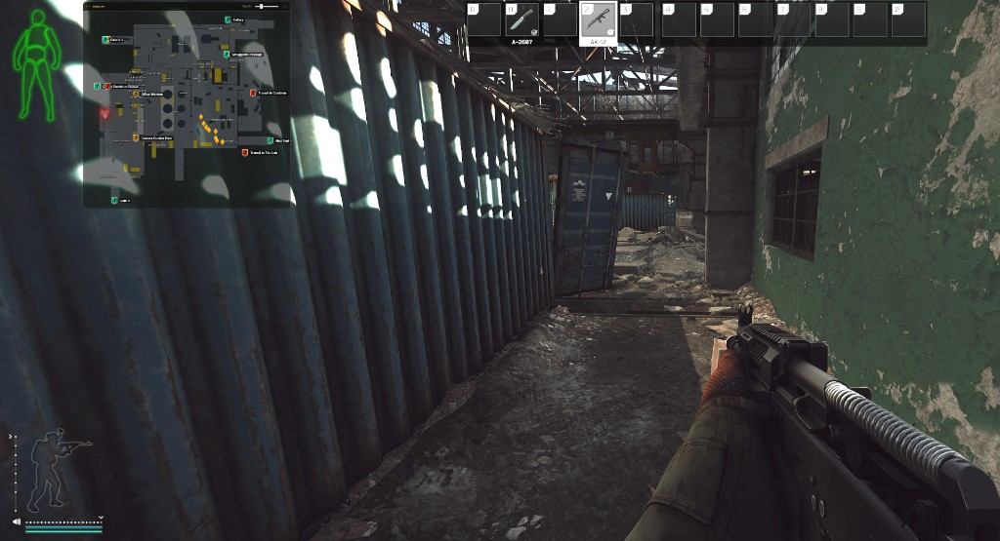

# SayserTarkovTracker

A Windows desktop map companion for **Escape from Tarkov**. It displays interactive tactical maps with live player tracking from in-game screenshots, raid exfil highlighting from the **O** key panel, plus extracts, quests, spawns, bosses, cultists, custom pins, hazards, and more — styled with a tactical HUD interface (**v2.6.1**).

Built with **WPF** (.NET 10) and **WebView2**.

---

## Screenshots

| Main window (Factory) | Settings |
|-----------------------|----------|
|  |  |

| Custom pins | Raid exfil highlights |
|-------------|------------------------|
|  |  |

| Overlay (in-game) |
|-------------------|
|  |

---

## Features

### Interactive maps
- SVG maps for all supported locations (Customs, Factory, Interchange, Labs, Lighthouse, Reserve, Shoreline, Streets of Tarkov, Woods, Ground Zero, Terminal, Labyrinth, and others)
- Pan and zoom the map with mouse drag and scroll wheel
- Click any marker to view details (name, type, conditions, coordinates)

### Map markers
Toggle marker layers individually or with **Show All** / **Hide All**:

| Category | Examples |
|----------|----------|
| Location names | Map labels (e.g. building names) |
| Extracts | PMC, Scav, Shared |
| Transits | Map-to-map transit points |
| Quests | Quest items and objectives |
| Spawns | PMC and Scav player spawn zones |
| Bosses | Boss spawn locations (Tagilla, Reshala, Killa, etc.) |
| **Cultists** | Cultist Priest spawn locations (separate from bosses) |
| **Custom Pin** | User-placed amber waypoint pins (see below) |
| Hazards | Mortars, minefields, danger zones |
| Switches | Power switches and similar |
| BTR stops | BTR route stops (Woods, Streets of Tarkov only) |

Markers use the same icon set as [tarkov.dev](https://tarkov.dev). Quest item markers can show the actual item icon when available.

#### Custom pins
- Enable **Custom Pin** in the **MARKERS** panel to enter placement mode (map cursor becomes a crosshair).
- **Right-click** on the map to drop an amber tactical pin.
- **Left-click** a pin to remove it.
- **Turn off** the Custom Pin toggle to clear **all** pins and exit placement mode.
- Pins are cleared automatically when you **change or reload** the map.
- Custom pins sync to the **Overlay** window when it is open.

#### Boss and cultist spawns
- **Boss** markers show where named bosses can spawn, using tarkov.dev zone and floor rules (only valid boss spawn points for the selected map level).
- **Cultists** are a **separate layer** with their own icon and MARKERS toggle — they are not mixed into the boss skull markers.
- Cultist markers appear only on maps that can have Cultist Priest spawns: **Customs**, **Woods**, **Shoreline**, **Ground Zero**, and **Factory**.
- On **Factory**, cultist locations come from **Night Factory** raid data (cultists do not spawn on day Factory in-game, but the markers are shown on the single Factory map for night raids).

#### BTR stops
On **Woods** and **Streets of Tarkov**, a **BTR Stops** toggle appears in MARKERS for the armored vehicle route.

### Settings
Open **SETTINGS** from the top bar (replaces the old screenshot-folder buttons on the main toolbar).

| Section | Options |
|---------|---------|
| **Screenshot folder** | Browse for your EFT Screenshots folder, open it in Explorer |
| **Screenshot parsing** | Enable/disable auto-watch and **Read Latest** |
| **Game resolution** | Preset dropdown + custom **Width × Height** with **SET** (tunes EXFIL OCR) |
| **Overlay default opacity** | Default transparency when the overlay opens (20–100%) |
| **Map actions** | **Clear raid exfil highlights** for the current map |
| **Screenshot maintenance** | **Delete all screenshots** in the configured folder (with confirmation) |
| **About** | App name and version (**2.6.1**) |

Settings are saved to `%AppData%\SayserTarkovTracker\settings.json`.

### Raid exfil highlighting (in-game **O** key)
During a raid, Escape from Tarkov lets you press **O** to open the **extraction / transit panel** in the top-right of the screen. It lists which extracts and transits are available to you this raid (PMC **EXFIL** lines, Scav **EXIT** lines, and orange **TRANSIT** entries).

SayserTarkovTracker reads that panel from your screenshots and highlights the matching points on the tactical map:

1. **Select the map** you are currently playing in the app dropdown.
2. **In raid**, press **O** so the extract/transit list is visible on screen.
3. **Take a screenshot** (same folder the app watches — configure in **SETTINGS**; default: `Documents\Escape from Tarkov\Screenshots`).
4. The app detects the green exfil panel, runs **OCR** on the text, and **matches** names against extract/transit data for that map (from tarkov.dev).
5. On the map:
   - **Matched extracts** pulse with a **green glow** and stay fully visible.
   - **Matched transits** pulse with an **amber/gold** label style.
   - **Other** extract and transit markers on that map are **dimmed** so your active options stand out.
6. The **RAID EXFILS** panel in the sidebar lists the matched extract and transit names and shows **ACTIVE FOR THIS MAP** when highlighting is on.

**Tips**
- Set **Game Resolution** in **SETTINGS** to your in-game resolution (or leave on Auto) — this improves OCR accuracy for the exfil panel.
- You must have the **correct map selected** before the screenshot; otherwise the app reports `EXFIL PANEL FOUND - SELECT MAP`.
- Highlights are cleared when you **change maps**, or manually via **SETTINGS → Clear raid exfil highlights**.
- Works in the **Overlay** window as well — highlights stay in sync with the main map.

This feature does not read game memory; it only uses your screenshot image and public map data.

### Live player tracking (screenshots)
- Monitors your **Escape from Tarkov Screenshots** folder (path set in **SETTINGS**)
- Parses coordinates and facing direction from screenshot filenames automatically (when parsing is enabled)
- Plots your position and bearing on the map in real time with a **large, glowing** player marker for visibility on dark maps
- LCD-style readout for X, Y, Z, and bearing in the sidebar

### Map levels (floors)
- Per-map floor/layer toggles (e.g. Factory basement, Ground Floor, 2nd Floor)
- Matches tarkov.dev behavior: optional levels overlay the base map; the base layer dims when extra floors are active
- **Base** layer toggle plus **All** / **None** for optional levels

### Overlay window
- Separate always-on-top **Glass HUD** overlay
- Semi-transparent, resizable (drag edges/corners)
- Adjustable opacity slider (default level set in **SETTINGS**)
- Syncs map, markers, levels, filters, custom pins, player position, and raid exfil highlights with the main window

### UI
- Dark tactical HUD theme (amber accents, monospace coordinates, terminal-style status bar)

---

## Requirements

- **Windows 10/11**
- **[.NET 10 SDK](https://dotnet.microsoft.com/download)** (target: `net10.0-windows`)
- **[WebView2 Runtime](https://developer.microsoft.com/microsoft-edge/webview2/)** (usually already installed on Windows 11)

---

## Build and run

```powershell
cd TarkovTracker
dotnet build
dotnet run
```

Or open `TarkovTracker.sln` in Visual Studio and run (F5).

---

## Usage

1. **Select a map** from the dropdown in the top bar.
2. Open **SETTINGS** and set your **screenshot folder** (default: `Documents\Escape from Tarkov\Screenshots`).
3. Take an in-game screenshot — the app watches the folder and updates your position automatically (if parsing is enabled).
4. Use **Read Latest** to manually parse the newest screenshot.
5. Toggle **Markers** and **Levels** in the right sidebar (including **Boss**, **Cultist**, **Custom Pin**, and **BTR Stops** where available).
6. Enable **Custom Pin**, then **right-click** the map to mark locations; **left-click** a pin to remove it.
7. During a raid, press **O** in-game and screenshot with the exfil panel open to highlight your active extracts and transits on the map.
8. Open **Overlay** for a floating map on top of the game.

---

## Project structure

```
TarkovTracker/
├── Assets/           # Map viewer CSS/JS (WebView2)
├── Config/           # Runtime JSON (maps, markers, levels, extracts, etc.)
├── docs/screenshots/ # README screenshots (optional)
├── Maps/             # SVG map files and interactive marker icons
├── Models/           # Data transfer objects
├── Services/         # Map data loading and HTML builder
├── SettingsWindow.xaml
├── Themes/           # WPF tactical UI styles
├── Tools/            # Dev scripts to refresh data from tarkov.dev (not used at runtime)
├── MainWindow.xaml   # Main application window
└── OverlayWindow.xaml
```

Map configuration and marker data live in `Config/`. Maintenance scripts in `Tools/` pull fresh data from the tarkov.dev API — see [`tools/README.md`](tools/README.md).

---

## Data sources and credits

This project is a **fan-made companion tool**. It is **not** affiliated with Battlestate Games.

### [tarkov.dev](https://tarkov.dev)

We rely heavily on the tarkov.dev project and community data:

| Used from tarkov.dev | Purpose |
|----------------------|---------|
| **SVG map graphics** | Interactive map backgrounds ([tarkov-dev-svg-maps](https://github.com/the-hideout/tarkov-dev-svg-maps)) |
| **Map metadata & coordinates** | Bounds, transforms, floor/layer definitions |
| **Game data API** | Extracts, spawns, transits, hazards, switches, labels, quests, boss spawns |
| **Interactive marker icons** | Extract, spawn, quest, hazard, switch, transit, boss, cultist, and BTR icons (`Maps/interactive/`, from [tarkov-dev](https://github.com/the-hideout/tarkov-dev)) |
| **Item icons** | Quest item marker images via `assets.tarkov.dev` |

Thank you to the [tarkov.dev](https://tarkov.dev) team and contributors for maintaining maps and open game data.

### Escape from Tarkov

*Escape from Tarkov* is a trademark of Battlestate Games Limited. This project is unofficial and for personal/educational use.

---

## Updating map data

To refresh quest markers, boss/cultist spawns, or map levels from the latest tarkov.dev API:

```powershell
cd tools
.\build_quest_markers_from_api.ps1
.\build_boss_spawn_markers.ps1
.\build_map_levels.ps1
```

To refresh boss spawn metadata and raw spawn points (including Night Factory cultist data merged onto Factory):

```powershell
powershell -ExecutionPolicy Bypass -File Tools\fetch-boss-data.ps1
```

See [`tools/README.md`](tools/README.md) for the full list of scripts.

---

## License

Personal use only.

---

## Disclaimer

Use at your own risk. Map data may lag behind game patches. Screenshot parsing depends on Escape from Tarkov's screenshot filename format and the in-game exfil panel layout; game updates or OCR misreads could affect player position or raid exfil highlighting.
